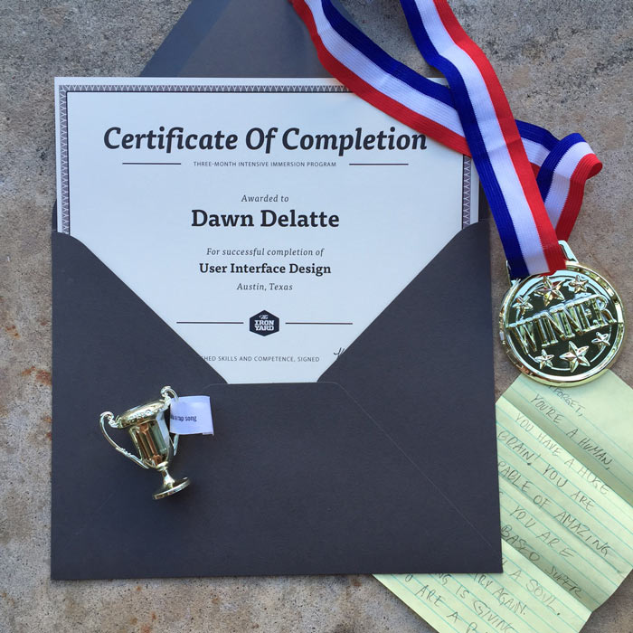
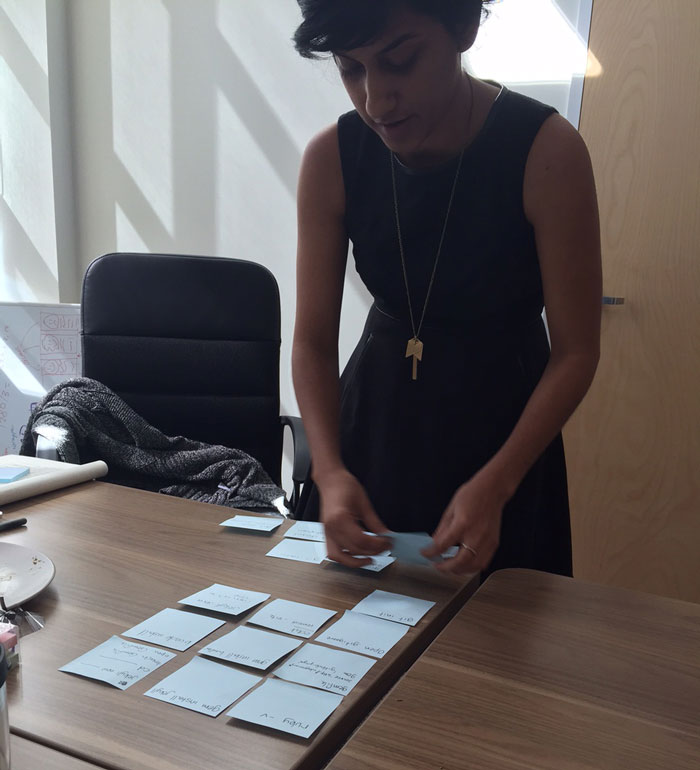
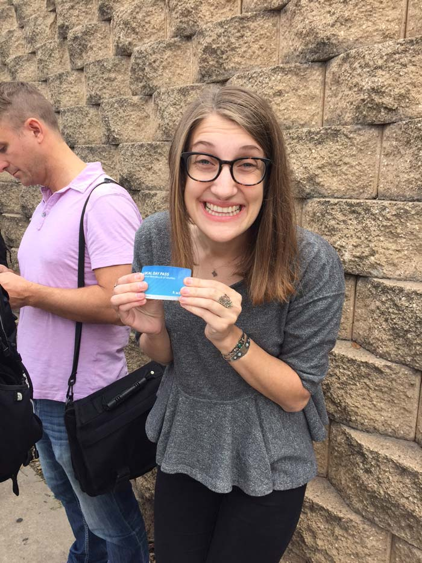
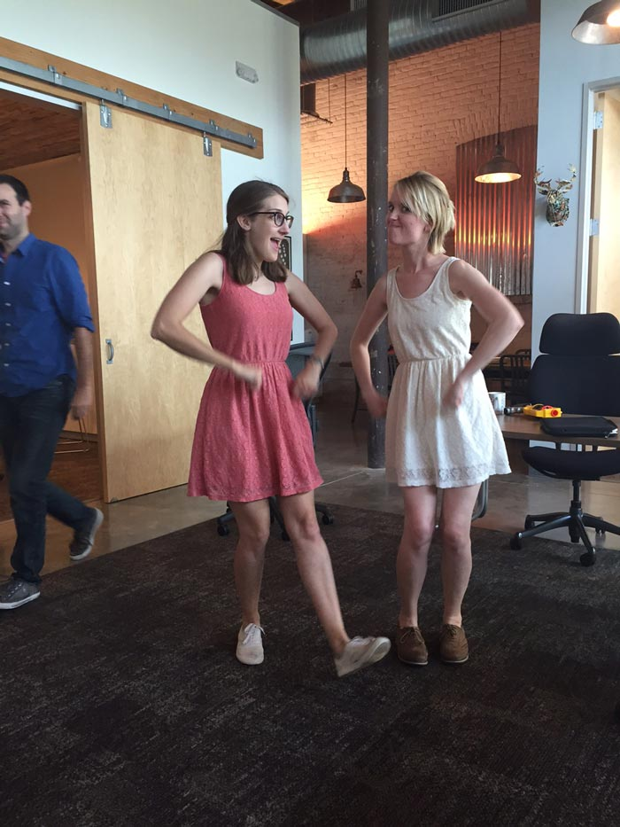
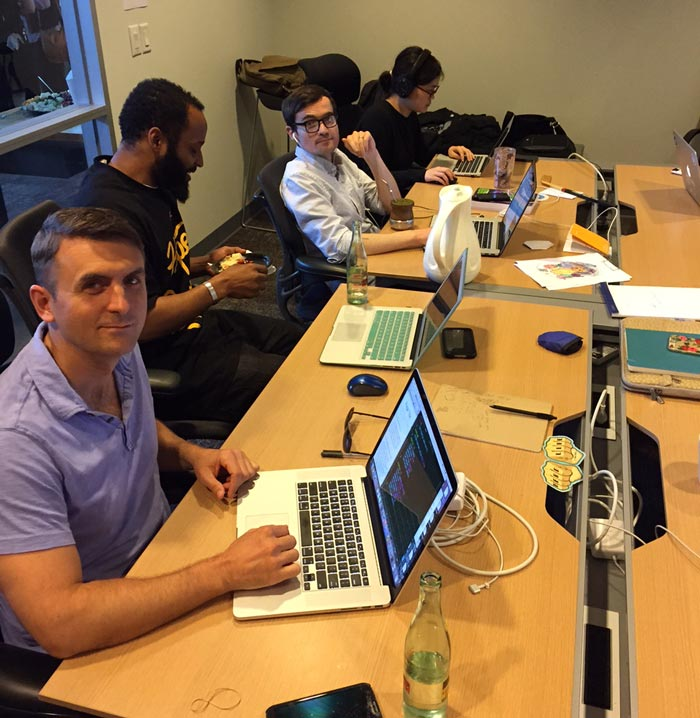
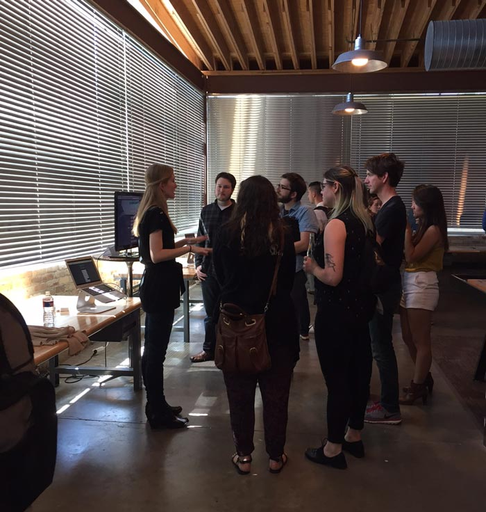
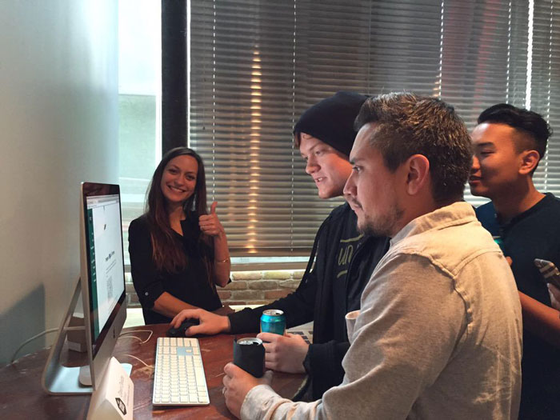
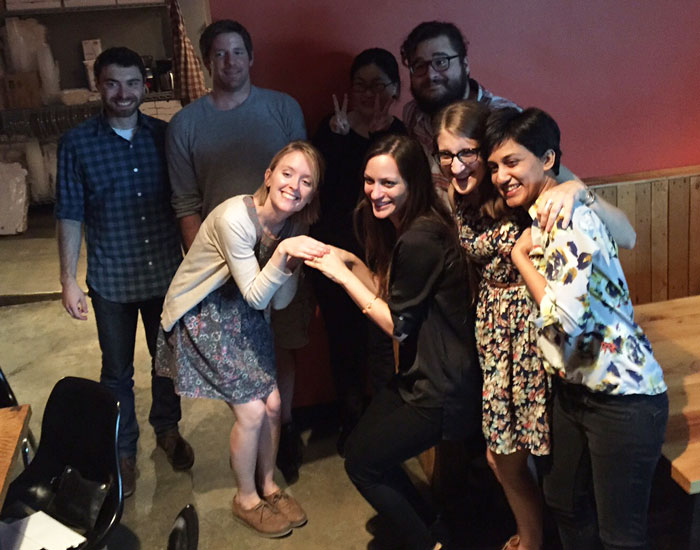

###I made it.
 
It's all over, but it's only just the beginning. 3 months ago I quit my job and walked into The Iron Yard, with some art and design fundamentals under my belt from college, but very little knowledge of code. There are so many things I learned from my experience at The Iron Yard. I mean, there are all the <a href="http://dawndelatte.com/about.html">skills I gained</a>, but beyond that... so much I learned about myself and my ability to move through really difficult problems in code, design, and self-assessment. I also learned about the importance of vulnerability and collaboration. Willingness to open up and talk to my teachers and peers when I was stuck or unsure was a huge part of my growth. I felt wide-eyed and full of wonder there, watching so many people learn and grow and build amazing, beautiful apps and websites. It was magic. 3 months ago, I didn't know a thing compared to what I know now. I can design and build a fully functional website, in a surprisingly short amount of time! I can do that. And 3 months from now, I will be able to do so much more. And 3 months after THAT...you get the point. It's hard to find all the words and things to say when reflecting on an experience like this. So I'll just show a few pictures for now.  

Some really great achievements right here. My certificate from TIY, “Best App” metal for <a href="#">this group project</a>, first-day-of-school letter from my husband, and my “most likely to break out into a rap song” trophy.

This is the day we found out about Sam's post-it note obsession.

This was Jesse's first time to ride the big city bus, headed downtown to our field trip at <a href="http://www.razorfish.com/">Razorfish</a>. She was elated, as you can see. 

Oh and here's Jesse and Katlyn dancing while Travis quickly tries to escape that situation, per the usual.

These guys on their demo day! Also, Rails room before the Design class took it over post ROR / FEE graduation.

Watching this lovely lady from the Front End Engineer class on their demo day, just basically kicking ass.

Scenes from the UI Design Demo Day. Awesome people from <a href="http://funsize.co/">Funsize</a> stopped by to check out our final projects.

UI Design class and staff at ABGB just being classic weirdos and making many, many cheers.

Here we go.

Hello World!

