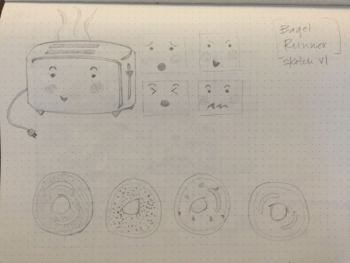
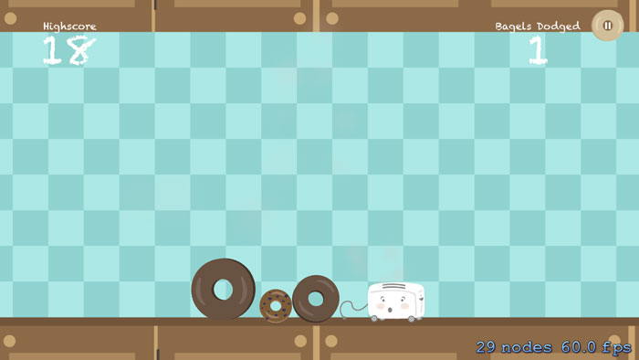

I was trying to come up with a clever title for this entry, but it turns out bagel in French...is just “bagel”. 

In the weeks after graduating from The Iron Yard, life has been full of peaks and valleys, sharpening of skills, shameless self-promotion, and a couple of awesome freelance opportunities. I had the pleasure of working with [Joe](http://jrocca.com/), a graduating Mobile Engineering student in Orlando, on his final project for TIY. He built a game called “Bagel Runner” in which a little toaster has to dodge a bunch of bagels hurdling toward him. I contributed the toaster, bagels, background, and main page/logo illustrations for the game. This project was as much fun to work on as it is to play. You can check out the App Store link and more about the process [here](http://dawndelatte.com/portfolio/bagelrunner.html).

I've been thinking about doing a bit of a redesign for my site. Adding more jeuje, as one might say. I find myself sitting up in bed, much to late, drooling over the sites on [awwwards.com](http://www.awwwards.com/). Recently I came across [jardins-poudriere](http://jardins-poudriere.ch/points-forts-promotion-orbe/), a French website for a luxury property development project. I'll give you a moment to soak that in...

I have an entire bookmarks folder filled with visually stunning and playfully interactive sites like [this](http://residence-mixte.com/), that I still visit after months of discovering. Ooo la la, I can't wait to dive in and see how everything I'm learning will transform the design. Stay tuned! 