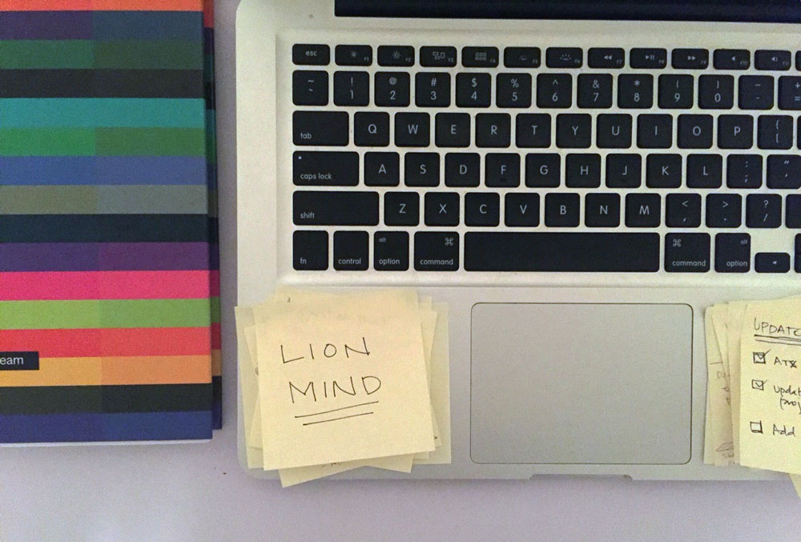

###Big Picturing.

A lot of things have happened in the last year. I mean, I guess everyone can say that right? But I'm not going to list off all of my experiences and the things I've learned. Nope, not in this post. In this post, I'm going to share a story I heard today. It's a short one, but it's great.  

So, imagine there's a dog sitting in front of you. You've got a bone, and you're waiving it around. Naturally, the dog can't take his eye's off of this bone. He/She follows it closely, and when you throw the bone across the room, the dog quickly runs for it. So far so good?

Ok, now imagine there's a big lion in front of you. There you are, with the bone, waiving it around. But the lion isn't interested in the bone. The lion has his eyes on you (big bag of bones, basically). So you throw the bone, and the lion looks at it, but he brings his attention right back to you...

Now here's <strike>the</strike> a metaphor... The dog runs after every bone, every little thing, every little distraction. The lion may notice the bone, but he keeps his eyes on the human, <em>the big picture</em>. 

Workin' on that lion mind. 

And there's my collection of post-it reminders and insights from throughout the day. Here's a little story behind the story. I use this app called [Stop, Breath & Think](http://stopbreathethink.org/). They recently updated some features and added a few new experiences. That's where I heard the lion mind vs. dog mind story and I highly recommend it.  

From a design perspective, I think it has great UI and usability, which is one of the things that drew me to the app in the first place. 

From a human perspective, it is an incredible (simple) tool that I can use at any point in my day or week to help me relax, clear my mind, and focus on my goals or gain new perspectives. 

Here's to more of that! And more writing. 

